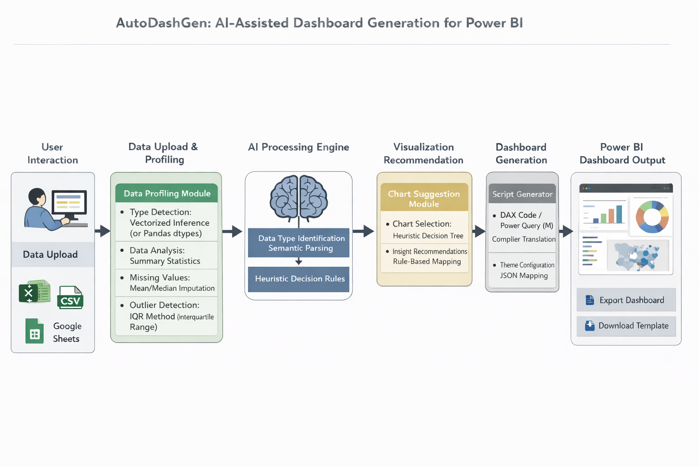

# 📊 AutoDashGen: AI-Powered Power BI Dashboard Generator

AutoDashGen is a full-stack application designed to automate the process of building Power BI dashboards. By uploading a CSV file, the platform's Python AI engine automatically profiles the dataset, handles missing data, generates optimized Power Query (M) code, designs custom DAX measures, recommends ideal visualization charts, and packages them with tailored Power BI visual themes.

---

## 🏗️ System Architecture

Below is the conceptual architecture of the AutoDashGen platform, outlining the flow from user data upload to compiling and exporting native Power BI dashboard artifacts:



---

## 🖥️ Application Walkthrough & Screenshots

### 1️⃣ Step 1: Upload Dataset
Easily upload your flat files (CSV) via the responsive drag-and-drop or file selector interface.
.png)

### 2️⃣ Step 2: Data Profiling & Cleaning Report
Once uploaded, the engine profiles columns, identifies data types, flags missing values, and allows you to apply cleaning methods (like outlier treatment using the IQR method).
.png)

### 3️⃣ Step 3: Interactive Visual Canvas
Review the AI-generated visual recommendations. The interface includes a draggable and resizable grid displaying various metric cards, line charts, bar charts, and data completeness summaries.
.png)

### 4️⃣ Step 4: Exporting Scripts & Themes
Easily download the compiled Power Query (M) scripts, custom DAX measures, and Power BI JSON themes. You can export individual scripts or package the whole setup into a `.zip` file.


### 5️⃣ Sample Generated Dashboard Outputs
Here is a preview of the layout grids produced by the generator:


---

## 🌟 Features

### 🧠 Backend AI & Data Profiling
- **📊 Dataset Profiling:** Automatically identifies data types (Numeric, Categorical, Date/Time) and detects missing values.
- **⚡ M-Query Generator:** Automates the creation of Power Query (M) scripts for data load and header promotion.
- **📈 DAX Measure Builder:** Generates ready-to-use DAX measures (Sums, Averages, aggregates) based on the profiled columns.
- **🎨 Power BI Theme Creator:** Generates fully customized Power BI JSON themes dynamically for consistent branding.
- **📦 PBIP Export System:** Packages the generated scripts, theme configuration, and measures into a Power BI Project (`.pbip`) structure.

### 💻 User Interface (React)
- **📂 CSV File Uploader:** Smooth drag-and-drop or select interface for dataset ingestion.
- **👁️ Interactive Preview Canvas:** Displays the AI-recommended visual charts and provides insight descriptions.
- **📥 Instant Export Controls:** Allows one-click downloads for DAX measure scripts and the custom theme JSON file.
- **📱 Fully Responsive Design:** Clean, modern workspace dashboard built to look great on all device screens.

---

## 🔧 Technologies Used

| Layer | Technology | Description |
|:---|:---|:---|
| **Frontend** | React.js | Dynamic, state-driven user interface |
| **Frontend Styling** | CSS3 | Custom typography, glassmorphism, responsive grids |
| **Backend** | Python / Flask | RESTful AI engine and API endpoints |
| **Data Processing** | Pandas | High-performance data analysis and dataset profiling |
| **Export Formats** | M-Query, DAX, JSON | Native formats fully compatible with Power BI Desktop |

---

## 📂 Project Structure

```text
AutoDashGen/
├── backend/
│   ├── app.py                # Main Flask API server
│   ├── logic/
│   │   ├── cleaner.py        # Data cleaning module
│   │   ├── generator.py      # DAX/M-query code generators
│   │   ├── pbip_builder.py   # PBIP dashboard packaging utility
│   │   ├── profiler.py       # Data analysis/profiler script
│   │   ├── recommender.py    # Chart recommendation engine
│   │   └── theme_generator.py# Power BI JSON theme generator
│   └── uploads/              # Storage folder for uploaded CSVs
├── frontend/
│   ├── public/               # Static icons, manifest, and index.html
│   ├── src/
│   │   ├── App.js            # Main React App interface
│   │   ├── App.css           # Styling rules and variables
│   │   └── index.js          # React entry point
│   └── package.json          # Node dependencies and scripts
├── images/                   # Screenshots and architecture diagrams
└── README.md                 # Project documentation
```

---

## 🚀 Getting Started

### 1️⃣ Backend Setup (Python)

1. Navigate to the `backend` folder:
   ```bash
   cd backend
   ```
2. Create and activate a virtual environment (optional but recommended):
   ```bash
   python -m venv venv
   # On Windows:
   .\venv\Scripts\activate
   # On macOS/Linux:
   source venv/bin/activate
   ```
3. Install the required libraries:
   ```bash
   pip install flask flask-cors pandas
   ```
4. Start the backend server:
   ```bash
   python app.py
   ```
   *The backend will run locally at `http://127.0.0.1:5000`.*

### 2️⃣ Frontend Setup (React)

1. Navigate to the `frontend` folder:
   ```bash
   cd frontend
   ```
2. Install npm dependencies:
   ```bash
   npm install
   ```
3. Launch the development server:
   ```bash
   npm start
   ```
   *The application will open in your browser at `http://localhost:3000`.*
